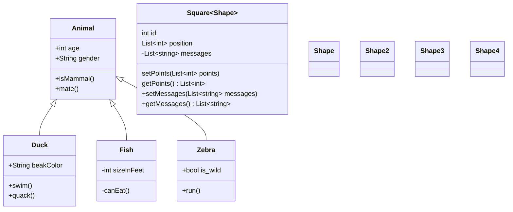
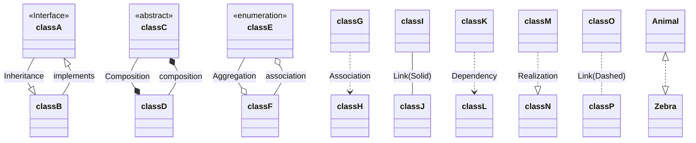
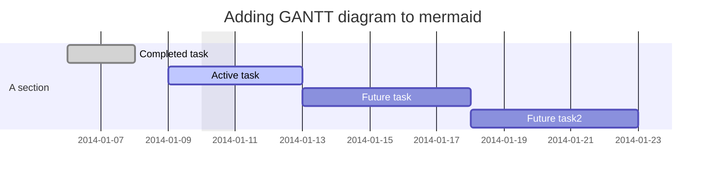
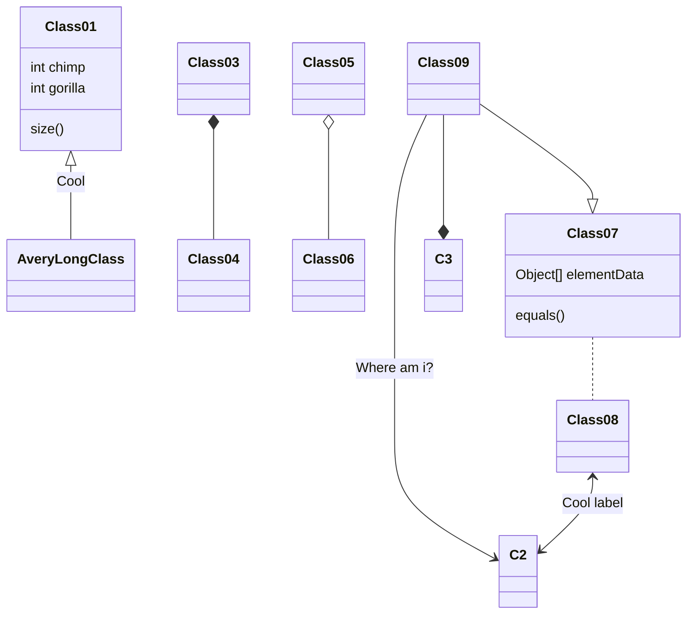
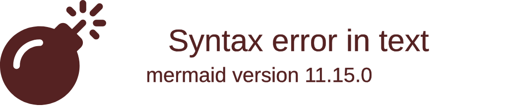

<details><summary>CLICK ME</summary>
<p>
    
#### We can hide anything, even code!

    ```ruby
      puts "Hello World"
    ```

</details> </p>

The Markdown will be collapsed by default.


After a reader clicks <svg version="1.1" width="16" height="16" viewBox="0 0 16 16" class="octicon octicon-triangle-right" aria-label="The right triange icon" role="img"><path d="M6.427 4.427l3.396 3.396a.25.25 0 010 .354l-3.396 3.396A.25.25 0 016 11.396V4.604a.25.25 0 01.427-.177z"></path></svg>, the details are expanded.


# Leer más
## Leer más
### Leer más
#### Leer más
##### Leer más

#https://mermaid-js.github.io/mermaid/#/
#https://docs.github.com/es/get-started/writing-on-github/working-with-advanced-formatting


# Título del Proyecto

_Acá va un párrafo que describa lo que es el proyecto_

## Comenzando 🚀

_Estas instrucciones te permitirán obtener una copia del proyecto en funcionamiento en tu máquina local para propósitos de desarrollo y pruebas._

Mira **Deployment** para conocer como desplegar el proyecto.


### Pre-requisitos 📋

_Que cosas necesitas para instalar el software y como instalarlas_

```
Da un ejemplo
```

### Instalación 🔧

_Una serie de ejemplos paso a paso que te dice lo que debes ejecutar para tener un entorno de desarrollo ejecutandose_

_Dí cómo será ese paso_

```
Da un ejemplo
```

_Y repite_

```
hasta finalizar
```

_Finaliza con un ejemplo de cómo obtener datos del sistema o como usarlos para una pequeña demo_

## Ejecutando las pruebas ⚙️

_Explica como ejecutar las pruebas automatizadas para este sistema_

### Analice las pruebas end-to-end 🔩

_Explica que verifican estas pruebas y por qué_

```
Da un ejemplo
```

### Y las pruebas de estilo de codificación ⌨️

_Explica que verifican estas pruebas y por qué_

```
Da un ejemplo
```

## Despliegue 📦

_Agrega notas adicionales sobre como hacer deploy_

## Construido con 🛠️

_Menciona las herramientas que utilizaste para crear tu proyecto_

* [Dropwizard](http://www.dropwizard.io/1.0.2/docs/) - El framework web usado
* [Maven](https://maven.apache.org/) - Manejador de dependencias
* [ROME](https://rometools.github.io/rome/) - Usado para generar RSS

## Contribuyendo 🖇️

Por favor lee el [CONTRIBUTING.md](https://gist.github.com/villanuevand/xxxxxx) para detalles de nuestro código de conducta, y el proceso para enviarnos pull requests.

## Wiki 📖

Puedes encontrar mucho más de cómo utilizar este proyecto en nuestra [Wiki](https://github.com/tu/proyecto/wiki)

## Versionado 📌

Usamos [SemVer](http://semver.org/) para el versionado. Para todas las versiones disponibles, mira los [tags en este repositorio](https://github.com/tu/proyecto/tags).

## Autores ✒️

_Menciona a todos aquellos que ayudaron a levantar el proyecto desde sus inicios_

* **Andrés Villanueva** - *Trabajo Inicial* - [villanuevand](https://github.com/villanuevand)
* **Fulanito Detal** - *Documentación* - [fulanitodetal](#fulanito-de-tal)

También puedes mirar la lista de todos los [contribuyentes](https://github.com/your/project/contributors) quíenes han participado en este proyecto. 

## Licencia 📄

Este proyecto está bajo la Licencia (Tu Licencia) - mira el archivo [LICENSE.md](LICENSE.md) para detalles

## Expresiones de Gratitud 🎁

* Comenta a otros sobre este proyecto 📢
* Invita una cerveza 🍺 o un café ☕ a alguien del equipo. 
* Da las gracias públicamente 🤓.
* etc.


```java
private String test(int var) {
  console.log("notice the blank line before this function?");
}
```
















---
⌨️ con ❤️ por [Villanuevand](https://github.com/Villanuevand) 😊